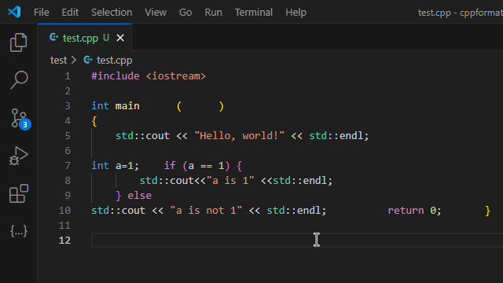

# CppFormat: Astyle Formatter for C, C++, and Header Files

### Format C/C++ files, including header files using [`AStyle`](https://astyle.sourceforge.net/astyle.html) with one keystroke `alt+shift+f` (windows) or `cmd+shift+f` (macOS).

    
    
    

---

---

## Usage

1. Open a file with extensions like `.c`, `.cpp`, `.h`, `.hpp`, `.cc`, or `.cxx`.
2. Press `alt+shift+f` (windows) or `cmd+shift+f` (macOS) to format the file.

## Features

- **Zero Configuration**: Simply open a file and press `alt+shift+f` (windows) or `cmd+shift+f` (macOS) to format the file.
- **Customizable Styles**: Leverage Astyle's popular formatting styles, such as:
  - Allman
  - K&R
  - GNU
  - Whitesmith
- **Header File Support**: Handles `.h` files as either C or C++.
- Use AStyle **Command Line Arguments** in the format: `pad-oper max-continuation-indent=120 style=google` in settings for the extension. [See Documentation](https://astyle.sourceforge.net/astyle.html)

---

## Requirements

Nothing needed. [`AStyle`](https://astyle.sourceforge.net/astyle.html) is bundled with the extension.

---

## Installation

1. Install the **CppFormat** extension from the Visual Studio Code marketplace and you're set!

---

## For more information or help

- [Email (abcd49800@gmail.com)](mailto:abcd49800@gmail.com)
- [Discord (CodePlayground)](https://discord.gg/ZeeqSBpjU2)
